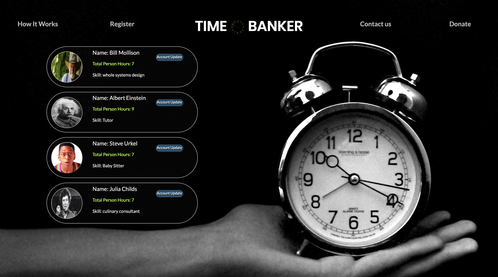

# TimeBanker

This app allows users of a community to register and update their accounts for a time bank that can exchange time hours of work as a virtual currency.

### Overview



The purpose of this project is to present members of a neighborhood or community with a platform, a time bank, that can strengthen their bonds among each other by engaging in activities or public services that can benefit others. The giver of services will receive credit from receivers. Since people live in the same neighborhood assume to have the same class, their time equivalence can also be assumed. One hour of service is tantamount to one credit, and the exchange of credit is followed by the completion of tasks demanded by receivers.

## How it Works

On the Home Page users can register (using the Register modal) and once they're registered, they can log into use TimeBanker. When logged in users can update their accounts by hitting the account update button.

## Built With

* HTML, Bootstrap, CSS
* Javascript, Node.js, Express, Passport (local), bCrypt, reCAPTCHA
* MySQL, Sequelize
* Mocha & Chai for testing

### Getting Started

## Deployment

This project app is deployed on Heroku with the database at 


### To install on a local machine

```
git clone https://github.com/Zhangjt9317/Project-2-Armadillos.git ## clone the repo to the local machine

cd Project-2-Armadillos ## switch the directory to the downloaded repo

npm install ## install the packages
 
An SQL Schema is included in the Models folder for the database

```


### Break down into end to end tests

Tests are run with mocha and chai, there are three tests included in the packages: canary test, get test and post test. 

```
npm run mocha
```

## Room for Improvements

Error Messaging to Users - Currently both the registration and login pages refresh if there are any errors upon submission without providing any notification to the user. This project will benefit greatly once flash messaging is incorporated to let users know what they need to change.

Password Reset/Recovery function

Account History function for users


## Authors

* **Jingtian Zhang** - *backend* - [see me](https://github.com/Zhangjt9317)

* **Nathaniel Holdsworth** - *UI design, backend* - [see me](https://github.com/nholdsworth)

* **Kristen Johanson** - *User Authentication - Login, Registration* - [see me](https://github.com/klbjklbj)

* **Zarina Mazieva** - *UI design, frontend* - [see me](https://github.com/zmazieva78)
